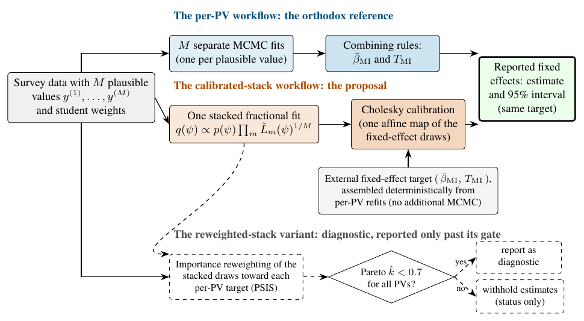

# About this guide {.unnumbered}

This is the replication package for *One Markov Chain Monte Carlo Fit for Many
Plausible Values: A Calibrated Stacked Posterior Workflow for Bayesian
Multilevel Models of Large-Scale Assessment Data* [@lee2026onemcmc]. Its one job
is to let you move from a number reported in the paper to the data, the
calculation, and the verification rule that produced it --- without taking any
result on faith, and without first learning the development history of the
project.

The guide is deliberately reproduction-focused. It walks you from a clean R
session to the paper's tables and figures and explains *how* each exhibit is
built and checked. The scientific write-up --- *what* we found and *why* each
modeling choice was made --- lives in the manuscript itself; this guide is its
computational companion.

## The problem in one paragraph

Large-scale assessments such as PISA do not observe a student's proficiency
directly. Instead they release a small set of $M$ *plausible values* (PVs)
--- draws from the posterior of each student's latent score given their item
responses and background [@mislevy1991; @wu2005]. The orthodox analysis treats
the $M$ PVs as $M$ multiply-imputed outcomes: it fits the analyst's model
separately to each PV and combines the $M$ estimates with Rubin's rules
[@rubin1987]. For a Bayesian multilevel model estimated by MCMC, that means
running the sampler $M$ times per analysis. This paper asks whether **one** MCMC
fit can stand in for those $M$ fits, and studies two one-fit alternatives whose
correctness is established --- and, for one of them, *gated* --- rather than
assumed.

```{r}
#| label: fig-workflows
#| echo: false
#| fig-cap: "The three workflows this package implements and compares. The per-PV workflow (top) is the orthodox reference. The calibrated stack (middle) replaces the $M$ fits with one stacked fit plus a deterministic affine calibration to the per-PV target. The reweighted stack (bottom) is a diagnostic variant that is reported only when its Pareto-$\\hat{k}$ gate passes for every plausible value."
#| fig-alt: "Flow diagram of the per-PV, calibrated-stack, and reweighted-stack workflows."

```

The three workflows in @fig-workflows are:

- **The per-PV workflow (the orthodox reference).** Fit the model to each of the
  $M$ plausible values and combine with Rubin's rules. This is the benchmark the
  paper reproduces and measures against, not a method it proposes.
- **The calibrated stack (the proposal).** Fit *one* stacked fractional model
  and map its fixed-effect draws, through a single Cholesky-based affine
  transformation, to the same mean and covariance the per-PV workflow would have
  reported. Agreement with the per-PV workflow is **by construction** --- the
  calibration targets it --- so it is a computational shortcut, not an
  independent confirmation.
- **The reweighted stack (a diagnostic variant).** Reweight the stacked draws
  toward each per-PV target with Pareto-smoothed importance sampling (PSIS)
  [@vehtari2024psis]. Computation is not permission to report: a country's
  reweighted estimates are released only if every plausible value clears a
  Pareto-$\hat{k} < 0.7$ diagnostic. The gate is enforced in code.

The mathematics behind each workflow is developed in @sec-methods.

## What this package reproduces

Two bodies of evidence, both regenerated from shipped, audited data products:

- **A simulation study.** A 24-condition Gaussian random-intercept experiment
  --- 12 mainstream conditions at 100 replications, 2 small-school-stress
  conditions at 400, and 10 PV-sensitivity conditions at 200 --- that scores four
  estimator legs (oracle, a per-PV frequentist comparator, per-PV MCMC, and the
  calibrated stack) on bias, coverage, and interval width with Monte Carlo
  standard errors [@morris2019]. It confirms that the calibrated stack recovers
  the per-PV fixed-effect estimates and their nominal coverage.
- **An empirical illustration.** A within/between-school analysis of the effect
  of socioeconomic status (ESCS) on PISA 2022 reading, for the United States and
  Korea, that shows all three workflows at work on real, informatively sampled
  assessment data --- including the reweighted stack's gate withholding Korea.

## The reproduction tracks {#sec-tracks}

The package exposes five tracks through a single entry point, `run_all.R`.
Tracks differ in where they start and what toolchain they need; @sec-setup covers
them in full.

| Track | Recomputes | Stan? | Typical purpose |
|---|---|:--:|---|
| **`quick`** *(default)* | every table and figure, from shipped evidence | No | read or check the paper |
| **`intermediate`** | Rubin pooling, CCC targets, aggregation, reporting gates | No | inspect the statistical transformations |
| **`simulation`** | a smoke subset, or the full 24-condition / 4,000-replication study | Yes | rebuild the simulation archive |
| **`pisa`** | the cached empirical evidence, or the full 22-fit refit | Yes | rebuild the empirical analysis |
| **`verify`** | manifests, numeric anchors, reporting gates, hygiene scans | No | audit the package |

Only `simulation --mode full` and `pisa --mode full` refit MCMC models and need
CmdStan; everything else runs from the committed evidence with CRAN packages
only.

## Quick start

On a fresh R 4.3 or newer installation, from the package root (or after opening
`pvstackr-replication.Rproj` in RStudio):

```sh
# 1. Restore the pinned package environment (once).
Rscript -e 'if (!requireNamespace("renv", quietly = TRUE)) \
  install.packages("renv", repos = "https://cloud.r-project.org"); \
  renv::restore(prompt = FALSE)'

# 2. Rebuild every reported table and figure from shipped evidence.
Rscript run_all.R --track quick

# 3. Audit the package: manifests, numeric anchors, gates, hygiene.
Rscript run_all.R --track verify
```

Both commands exit with status `0` on success and write nothing outside
`output/` and `verification/reports/`. @sec-setup walks through setup in full,
and @sec-repro explains what `verify` checks.

## What every registered result maps to

Reproduction here is not "run it and trust the output." Every table, figure, and
inline number the paper reports is registered in
`verification/reproduction-map.csv` with its authority (main text or supplement),
its public input, the script that produces it, and the rule that verifies it.
The live summary below is read from that file:

```{r}
#| label: tbl-repro-map
#| echo: false
#| tbl-cap: "Registered reproduction targets by track and status, read live from `verification/reproduction-map.csv`."
root <- getwd()
while (!file.exists(file.path(root, "pvstackr-replication.Rproj")) && dirname(root) != root) root <- dirname(root)
map_path <- file.path(root, "verification", "reproduction-map.csv")
if (file.exists(map_path)) {
  m <- utils::read.csv(map_path, stringsAsFactors = FALSE)
  tab <- as.data.frame(table(Track = m$track, Status = m$status))
  tab <- tab[tab$Freq > 0, ]
  knitr::kable(tab, row.names = FALSE, col.names = c("Track", "Verification status", "Targets"))
} else {
  cat("reproduction-map.csv not found; run from the package root.\n")
}
```

Two statuses read `reproduced_with_disclosed_*` rather than a bare `reproduced`.
That is deliberate: where the submitted manuscript's wording and the frozen
archive disagree, this package **reproduces the archive and reports the
difference** instead of quietly editing an input until a sentence becomes true.
Those disclosures are collected in @sec-repro and in
`docs/known-source-discrepancies.md`.

## How to read the rest of this guide

| Chapter | What it covers |
|---|---|
| @sec-setup | Environment, the five tracks, the self-locating path model, the toolchain |
| @sec-methods | The mathematics: the point identity, Rubin pooling, the CCC calibration, the PSIS gate |
| @sec-simulation | The simulation design, seed scheme, and headline coverage evidence |
| @sec-pisa-data | Obtaining PISA data under OECD terms, the analytic sample, and the survey weights |
| @sec-pisa-workflows | The empirical A/B/C results, the Korea withholding, and the figures |
| @sec-repro | The manifest, the verification suite, and the reproduce-vs-disclose boundary |
| @sec-faq | Short answers to the questions this design raises |

The companion R package [**pvstackr**](https://github.com/joonho112/pvstackr)
documents the general-purpose API; this package ships a frozen, portable copy of
the exact engine that produced the paper's random-intercept results
(see @sec-setup).
