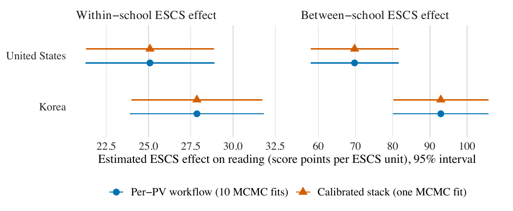
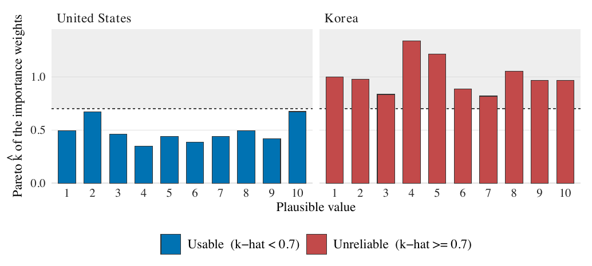

# PISA workflows and results {#sec-pisa-workflows}

This chapter presents the empirical results the three workflows produce on PISA
2022 reading, and shows the reweighted stack's gate (@sec-psis) doing its job:
reporting the United States and withholding Korea. The evidence is built by
`code/03_pisa/` and rendered by `code/04_exhibits/`.

## The 22-fit topology {#sec-pisa-topology}

The full empirical analysis is 22 MCMC fits:

- **20 per-PV fits** --- ten plausible values in each of the two countries ---
  which **Pipeline A** pools with Rubin's rules (@eq-rubin-components,
  @eq-tmi) into the per-PV reference $(\bar\beta_{\mathrm{MI}}, T_{\mathrm{MI}})$
  for each country;
- **2 stacked fits** --- one per country --- whose fixed-effect draws
  **Pipeline C** calibrates to that country's Pipeline A target through the
  affine map of @eq-ccc;
- **Pipeline B** reuses each country's stacked fit as an importance-sampling
  proposal and computes the 20 per-PV PSIS diagnostics of @eq-isratio.

## The main result: within- and between-school ESCS effects {#sec-pisa-table4}

Table 4 of the paper reports the within- and between-school ESCS effects for
each country under the per-PV workflow (A) and the calibrated stack (C). It is
read live below:

```{r}
#| label: tbl-pisa-main
#| echo: false
#| tbl-cap: "PISA 2022 reading: within- and between-school ESCS effects under the per-PV workflow (A) and the calibrated stack (C), in score points per ESCS unit with 95% intervals. Read live from `output/tables/table4_pisa_main.csv`."
root <- getwd()
while (!file.exists(file.path(root, "pvstackr-replication.Rproj")) && dirname(root) != root) root <- dirname(root)
t4_path <- file.path(root, "output", "tables", "table4_pisa_main.csv")
if (file.exists(t4_path)) {
  t4 <- utils::read.csv(t4_path, stringsAsFactors = FALSE, check.names = FALSE)
  num <- vapply(t4, is.numeric, logical(1))
  t4[num] <- lapply(t4[num], function(x) round(x, 2))
  knitr::kable(t4, row.names = FALSE)
} else {
  cat("table4_pisa_main.csv not found; run `--track quick` first.\n")
}
```

The per-PV and calibrated-stack columns agree to two decimals. As @sec-ccc
stresses, that agreement is **by construction** --- Pipeline C is calibrated to
the Pipeline A target --- so it demonstrates that the one-fit calibration
reproduces the $M$-fit reference, not that two independent methods happen to
concur. The same result is shown as a forest plot in @fig-pisa-forest.

::: {#fig-pisa-forest}
{fig-alt="Forest plot of the within-school and between-school ESCS effects for the United States and Korea, comparing the per-PV workflow and the calibrated stack; the two nearly coincide." width="100%"}

Estimated ESCS effect on reading (score points per ESCS unit, 95% interval) for
the within-school (left) and between-school (right) effects. For both countries
the per-PV workflow (ten MCMC fits) and the calibrated stack (one MCMC fit)
coincide.
:::

::: {.callout-note}
## The degrees of freedom behind Table 4

The intervals in Table 4 use the archived **classic-Rubin** degrees of freedom
(`df_method = "classic"`), even though the manuscript text calls them
Barnard--Rubin intervals. Because the degrees of freedom are large, the two
conventions coincide to the two decimals shown. This package reproduces the
archived endpoints and discloses the naming difference; see @sec-repro.
:::

## The reweighted stack and the reporting gate {#sec-pisa-gate}

Pipeline B asks whether the *individual* per-PV posteriors can be recovered from
the single stacked fit by importance reweighting. Whether its estimates may be
reported is decided, country by country, by the all-PV Pareto-$\hat k$ gate of
@eq-gate. The per-PV diagnostics are shown in @fig-pisa-khat.

::: {#fig-pisa-khat}
{fig-alt="Pareto k-hat of the importance weights for each of the ten plausible values, by country; all ten U.S. values are below the 0.7 threshold and all ten Korean values are at or above it." width="100%"}

Pareto-$\hat k$ of the importance weights for each of the ten plausible values.
The United States (left) is entirely below the $0.7$ threshold (dashed line),
so importance reweighting is reliable; Korea (right) is entirely at or above it.
:::

For the **United States**, all ten $\hat k$ values fall between about $0.35$ and
$0.67$: the gate passes (10 of 10) and the reweighted estimates are reportable.
For **Korea**, all ten exceed $0.7$, ranging from about $0.82$ to $1.34$, and the
effective sample sizes collapse to roughly 5--30 out of the stacked draws: the
gate fails (0 of 10). Korea's reweighted numbers are computed internally but
returned as missing with `status = "computed_but_withheld"`. Table 5 reports the
reweighting result where it is permitted:

```{r}
#| label: tbl-pisa-reweight
#| echo: false
#| tbl-cap: "Pipeline B reweighting result relative to Pipeline A, reported only where the PSIS gate passes. Read live from `output/tables/table5_pisa_reweighting.csv`."
root <- getwd()
while (!file.exists(file.path(root, "pvstackr-replication.Rproj")) && dirname(root) != root) root <- dirname(root)
t5_path <- file.path(root, "output", "tables", "table5_pisa_reweighting.csv")
if (file.exists(t5_path)) {
  t5 <- utils::read.csv(t5_path, stringsAsFactors = FALSE, check.names = FALSE)
  num <- vapply(t5, is.numeric, logical(1))
  t5[num] <- lapply(t5[num], function(x) round(x, 4))
  knitr::kable(t5, row.names = FALSE)
} else {
  cat("table5_pisa_reweighting.csv not found; run `--track quick` first.\n")
}
```

## A secondary robustness contrast {#sec-pisa-reversal}

The paper also reports a weighting-sensitivity contrast (Figure S3) as a
**secondary** result. Two numbers that appear near it must not be conflated:
the model-based Pipeline A/C between-school gap between Korea and the United
States (about $23.20$ score points) and an older, design-based level-1
final-weight-only comparator (about $23.58$). They travel through different
covariance and target routes and answer related but non-identical questions;
@sec-faq expands on the distinction. This contrast is robustness evidence, not a
headline claim.

## Running the empirical analysis {#sec-pisa-run}

The cached path rebuilds all of the above from sanitized draw and target objects
--- development paths replaced by logical source identifiers, an inspectable CSV
beside every paper-facing RDS --- with no microdata and no Stan:

```sh
Rscript run_all.R --track pisa -- --mode cached
```

The full path refits all 20 Pipeline A tasks, pools their new draws with the
archived classic-Rubin convention, and calibrates two new Pipeline C fits to that
freshly pooled target. Pipeline B is then **re-audited from the released
per-draw log-ratio evidence**; regenerating those log ratios from a newly fitted
proposal is not automated in this release, and the command reports that boundary
explicitly rather than pretending to cross it.

```sh
Rscript run_all.R --track pisa -- --mode full            # 22-task preflight
Rscript run_all.R --track pisa -- --mode full --execute  # refit A and C; re-audit B
```

Full mode requires the authorized local OECD data prepared in @sec-pisa-data. The
preflight writes the 22-task manifest and checks the R / CmdStan / C++ toolchain;
`--execute` starts or resumes the fits.
