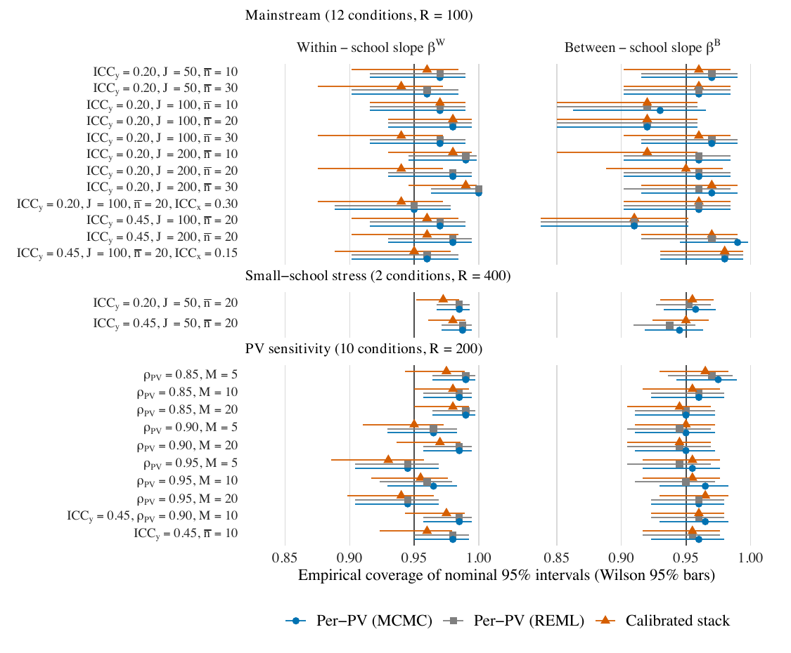

# The simulation study {#sec-simulation}

The simulation asks a question the empirical analysis cannot: when the true
fixed effects are *known*, does the calibrated stack recover them --- and their
nominal interval coverage --- as well as the per-PV workflow it replaces? This
chapter describes the study in the ADEMP terms of @morris2019 (data-generating
process, estimands, methods, and performance measures with Monte Carlo standard
errors), then shows how to inspect its evidence and, if you wish, replay it. The
engine lives in `code/02_simulation/`.

## The data-generating process {#sec-sim-dgp}

Each replication draws a two-level Gaussian dataset from the model of
@eq-model with two known fixed slopes,
$$
\beta^{W} = 0.40 \qquad\text{(within-school)}, \qquad
\beta^{B} = 0.60 \qquad\text{(between-school)},
$$
and then generates $M$ plausible values for the latent outcome at a controlled
reliability. The design crosses factors chosen to bracket the two countries of
the empirical analysis and to stress the workflow where it is most likely to
strain:

| Factor | Levels | Role |
|---|---|---|
| Outcome ICC $\mathrm{ICC}_y$ | 0.20 (U.S.-like), 0.45 (Korea-like) | how much variance is between schools |
| Schools $J$ | 50, 100, 200 | the level-2 sample size |
| Mean school size $\bar n$ | 10, 20, 30 | the level-1 sample size |
| Covariate ICC $\mathrm{ICC}_x$ | 0.15, 0.30 | contextual separation of $\beta^{W},\beta^{B}$ |
| PV correlation $\rho_{\mathrm{PV}}$ | 0.85, 0.90, 0.95 | plausible-value reliability |
| Number of PVs $M$ | 5, 10, 20 | imputation count |

Design generation (`code/02_simulation/dgm/`) draws the population, samples
schools and students, imposes an informative sampling weight, and generates the
plausible values, each step keyed to a deterministic seed (@sec-sim-seeds).

## The 24-condition design {#sec-sim-grid}

The factors are crossed into 24 retained conditions in three strata, read live
from the frozen design below:

```{r}
#| label: tbl-sim-design
#| echo: false
#| tbl-cap: "The three simulation strata, their condition counts, and per-condition replication tiers, read live from `output/tables/table2_simulation_design.csv`."
root <- getwd()
while (!file.exists(file.path(root, "pvstackr-replication.Rproj")) && dirname(root) != root) root <- dirname(root)
d_path <- file.path(root, "output", "tables", "table2_simulation_design.csv")
if (!file.exists(d_path))
  d_path <- file.path(root, "data", "precomputed", "simulation", "design.csv")
if (file.exists(d_path)) {
  d <- utils::read.csv(d_path, stringsAsFactors = FALSE, check.names = FALSE)
  knitr::kable(d, row.names = FALSE)
} else {
  cat("Design table not found; run `--track quick` from the package root first.\n")
}
```

The three strata are: a **mainstream** block (12 conditions at 100 replications
each), a **small-school-stress** block (2 conditions at 400), and a
**PV-sensitivity** block (10 conditions at 200). That is $12\times100 +
2\times400 + 10\times200 = 4{,}000$ replications in total.

## Estimands, methods, and the 16,000-row evidence table {#sec-sim-legs}

The estimands are the two true slopes $\beta^{W}$ and $\beta^{B}$. Every
replication is analyzed by **four** estimator legs, so every comparison is
within-dataset:

1. **oracle** --- the model fit to the *true* latent outcome (the unattainable
   best case);
2. **per-PV frequentist** --- an `lme4` refit to each plausible value, pooled by
   Rubin's rules;
3. **per-PV MCMC** (`bayes_a`) --- the Bayesian per-PV reference of @sec-perpv;
4. **calibrated stack** (`cdirect`) --- the one-fit proposal of @sec-ccc.

With 4 legs $\times$ 4,000 replications, the inspectable evidence table
`data/precomputed/simulation/parity_per_rep.csv` has exactly **16,000 rows**.
Pipeline B is not part of the simulation and is *not* represented by placeholder
rows.

::: {.callout-note}
## An honest label: "REML" is fit by ML

The per-PV frequentist leg is labeled *per-PV REML* in the manuscript and its
reproduced exhibits (including the legend of @fig-sim-coverage), but the archived
producer fits it with maximum likelihood (`REML = FALSE`). This package ships
the archived ML numbers and records the naming difference rather than relabeling
the evidence. The distinction is immaterial to the fixed-effect comparison at
these sample sizes, but it is disclosed rather than hidden; see @sec-repro.
:::

## The seed scheme {#sec-sim-seeds}

Reproducibility rests on two deliberately separated seed domains, so that a
change to the sampler can never perturb the generated population, sample, or
plausible values:
$$
\text{data generation: root } 20260514, \qquad
\text{MCMC: root } 20260601 .
$$
Within a replication, each task seed is a deterministic function of the
condition and replication identifiers; the per-PV MCMC fit $m$ uses
$20260601 + m$ and the stacked fit uses $20260601$. The contract is asserted by
`code/02_simulation/seed_protocol.R` and re-checked by the test suite. Given the
seeds, every dataset and every fit is exactly regenerable up to the
floating-point reproducibility of CmdStan's C++ backend.

## Performance measures and the headline {#sec-sim-results}

Each leg is scored on absolute bias, empirical coverage of nominal 95%
intervals, and mean interval width, each carrying a Monte Carlo standard error
so that every number comes with its own simulation uncertainty [@morris2019].
The headline table of the paper reports these for the two slopes, read live
below:

```{r}
#| label: tbl-sim-headline
#| echo: false
#| tbl-cap: "Simulation headline (bias and coverage by slope and estimator), read live from `output/tables/table3_simulation_headline.csv`."
root <- getwd()
while (!file.exists(file.path(root, "pvstackr-replication.Rproj")) && dirname(root) != root) root <- dirname(root)
h_path <- file.path(root, "output", "tables", "table3_simulation_headline.csv")
if (file.exists(h_path)) {
  h <- utils::read.csv(h_path, stringsAsFactors = FALSE, check.names = FALSE)
  knitr::kable(h, row.names = FALSE)
} else {
  cat("table3_simulation_headline.csv not found; run `--track quick` first.\n")
}
```

The full picture is the per-condition coverage in @fig-sim-coverage. Across all
24 conditions and both slopes, the calibrated stack (orange) tracks the per-PV
MCMC (blue) and per-PV frequentist (grey) references, with empirical coverage
clustered around the nominal 0.95: the maximum absolute bias across non-oracle
strata is below 0.006, and coverage stays within roughly 0.945--0.960.

::: {#fig-sim-coverage}
{fig-alt="Empirical coverage of nominal 95% intervals for the within-school and between-school slopes, across 24 conditions in three strata, for the per-PV MCMC, per-PV frequentist, and calibrated-stack estimators." width="100%"}

Empirical coverage of nominal 95% intervals (Wilson bars) for the within-school
slope $\beta^{W}$ (left) and between-school slope $\beta^{B}$ (right), across the
24 conditions. The three estimators --- per-PV MCMC, per-PV frequentist, and the
calibrated stack --- coincide to within Monte Carlo error around 0.95.
:::

The diagnostic health of the fits is summarized live from the 48 archived
diagnostic replications:

```{r}
#| label: tbl-sim-diagnostics
#| echo: false
#| tbl-cap: "Convergence summary across the 48 diagnostic replications, read live from `data/precomputed/simulation/diagnostics.csv`."
root <- getwd()
while (!file.exists(file.path(root, "pvstackr-replication.Rproj")) && dirname(root) != root) root <- dirname(root)
dg_path <- file.path(root, "data", "precomputed", "simulation", "diagnostics.csv")
if (file.exists(dg_path)) {
  dg <- utils::read.csv(dg_path, stringsAsFactors = FALSE)
  rhat_max <- max(c(dg$bayes_a_rhat_max, dg$cdirect_rhat_max))
  div_tot  <- sum(dg$bayes_a_div) + sum(dg$cdirect_div)
  knitr::kable(
    data.frame(
      Quantity = c("Diagnostic replications",
                   "Maximum split-$\\hat R$ (MCMC and stack)",
                   "Total divergent transitions"),
      Value    = c(as.character(nrow(dg)),
                   format(rhat_max, digits = 8),
                   as.character(div_tot))
    ),
    row.names = FALSE
  )
} else {
  cat("diagnostics.csv not found; run from the package root.\n")
}
```

::: {.callout-note}
The maximum split-$\hat R$ reported above is stored to full precision. The paper
displays it rounded to `1.020`; the exact value is slightly larger, and the
verifier keeps both the exact number and the rounding rule so the display is
honest rather than an exact upper bound (@sec-repro).
:::

## Inspecting and replaying the study {#sec-sim-replay}

The shipped bundle is a deterministic transform of 4,000 audited *shards* --- one
per replication. Building it checks keys, schema, finiteness, and completion
before writing the combined RDS and CSV, and aggregation re-checks the full
condition-by-replication-by-estimator grid. You can validate all of this without
touching Stan:

```sh
Rscript run_all.R --track simulation --dry-run -- --mode smoke   # print the command only
Rscript run_all.R --track simulation -- --mode smoke             # validate archive + controls
```

The smoke run exercises the completeness checks and the adversarial negative
controls (a corrupt or incomplete grid must fail). Adding `--execute` runs one
live reduced replication through the real fitting path.

A from-scratch rerun is a parallel-hardware job, not a laptop check:

```sh
Rscript run_all.R --track simulation -- --mode full             # 4,000-task preflight
Rscript run_all.R --track simulation -- --mode full --execute   # run or resume the study
```

Two safeguards make the full replay trustworthy:

- **Content-bound resume.** Each shard is bound to the design, the seeds, the
  source, the configuration, *and its own content* by a recomputed signature. An
  interrupted run resumes only from shards that still validate; a stale or
  divergent shard is rejected rather than reused.
- **A frozen-archive gate.** The full aggregator compares the newly computed
  per-replication and summary results against the frozen archive before
  accepting them, so a silent numerical drift becomes a loud failure.

The reference budget is roughly 63 hours on 12 workers, but wall-clock time
depends on the CPU, the toolchain, and the CmdStan version.
